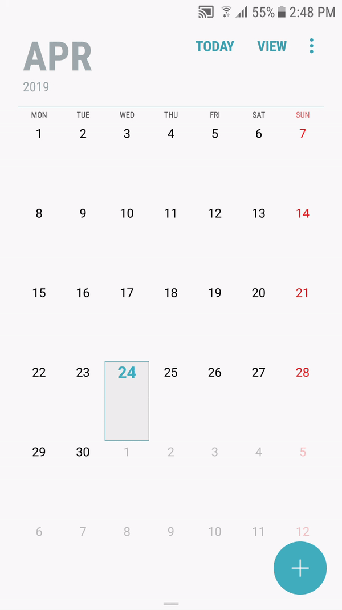

# Meetings are not displayed in the Meetings tab.

## Have you selected Active calendar in the "My Meeting Video" app settings? If not, do the following: 
* open My Meeting Video app
* open Meetings 
* open Settings 
* open Calendar
* select the needed calendar 

## Still don't see the Meetings? Check, if it's displayed in the device calendar. If not, then add the calendar. How to add needed calendar: 
* open device Calendar
* open Settings
* go Manage calendars
* press Add account
* select Google(or any other)
* login to needed account 
* press "I agree to Google Terms of services
* scroll down and press "Accept" 
* check added Calendar (if it's not checked)
* wait a bit until Meetings appear

## Calendar is added to the device, but meetings are not visible in the device calendar. Try to sync the calendar:
* open device Settings
* scroll to "Cloud and account"
* open Accounts
* open Google
* open Menu
* tap Sync now

## Or 
* open the device Calendar
* open Settings
* open "Manage calendars"
* uncheck and check this calendar 
* back to the calendar

