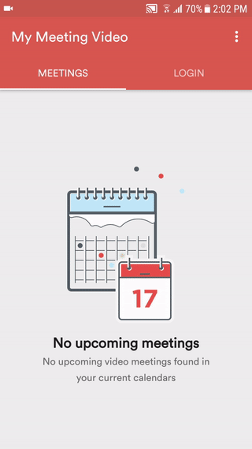

# Meetings are not displayed in the Meetings tab.

## Have you selected Active calendar in the "My Meeting Video" app settings? If not, do the following: 
* open My Meeting Video app
* open Meetings 
* open Settings 
* open Calendar
* select the needed calendar 

## Still don't see the Meetings? Check, if it's displayed in the device calendar. If not, then add the calendar. How to add needed calendar: 
* open device Calendar
* open the settings menu
* open "Manage calendars"
* tap "Add account"
* select Google (or any other provider)
* login to the needed account
* tap "I agree to Google Terms of services"
* scroll down and tap "Accept" 
* wait a bit until the meetings appear

## Calendar is added to the device, but meetings are not visible in the device calendar. Try to sync the calendar:
* open device Settings
* scroll to "Cloud and account"
* open Accounts
* open Google
* open the top right menu
* tap Sync now

##  An alternative way to sync the calendar
* open the device Calendar
* open Settings
* open "Manage calendars"
* uncheck and check your calendar 
* go back to the calendar

