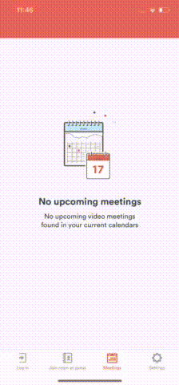
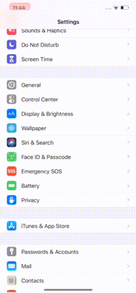
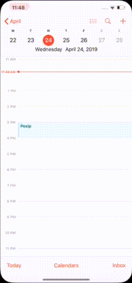

# Meetings are not displayed in the Meetings tab.

## Have you selected Active calendar in the "My meeting video" app settings? If not, do the folowing: 
* open My meeting video app
* go Settings
* go Meetings
* go Active calendars
* check needed calendar, if it's unchecked

## Still don't see the Meetings? Check, if it's displayed in the device calendar. If, it's not, then you need to add calendar. How to add calendar: 
* open device Settings
* scroll to Passwords and Accounts
* click Add account
* select Google(or any other)
* login to needed account 
* open account details and check Calendars option (if needed)

## Calendar added to the device, but Meeting are not visible in device calendar. Try to refresh calendar:
* open device calendar
* click Calendars
* added calendar should be checked
* uncheck and check this calendar 
* back to calendar

