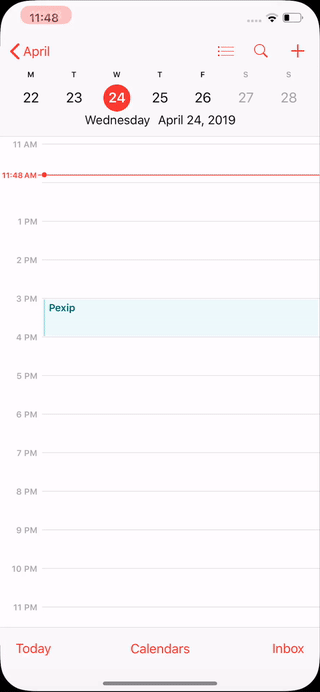

# Meetings are not displayed in the Meetings tab.

## Have you selected Active calendar in the "My Meeting Video" app settings? If not, do the following: 
* open My Meeting Video app
* open Settings
* open Meetings
* open Active calendars
* select the needed calendar 

## Still don't see the Meetings? Check, if it's displayed in the device calendar. If not, then add the calendar. How to add the needed calendar: 
* open the iOS Settings
* scroll to Passwords and Accounts
* tap on Add account
* select Google (or any other)
* login to the account 
* in the account details and the Calendars option must be selected

## Calendar added to the device, but meetings are not visible in the device calendar. Try to refresh the calendar:
* open the iOS Calendar app
* tap on Calendars
* the added calendar should be checked
* uncheck and check this calendar 
* go back to the calendar

